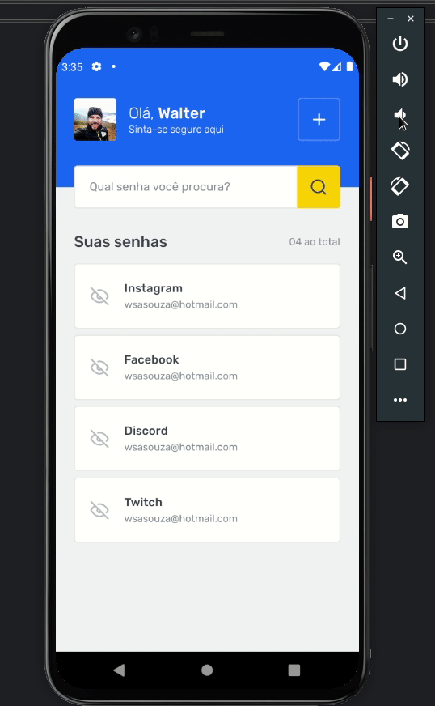

# Save Pass

  Aplicação de gerenciamento de senhas: SavePass.
  Essa aplicação possui duas telas, sendo a primeira delas uma listagem das senhas salvas e a segunda a tela de cadastro de novos logins.  

## Tecnologias:
 

 
 
 
<h1 align="center">
  
</h1>